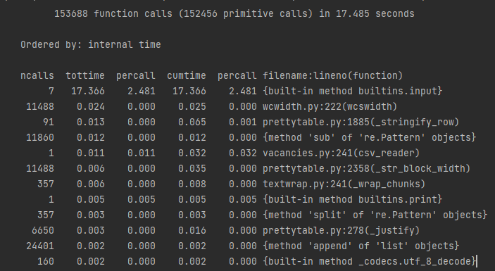
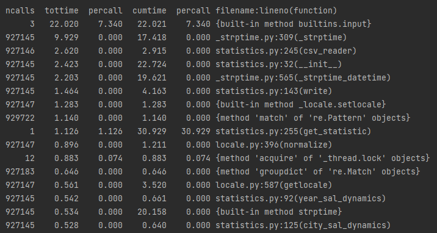
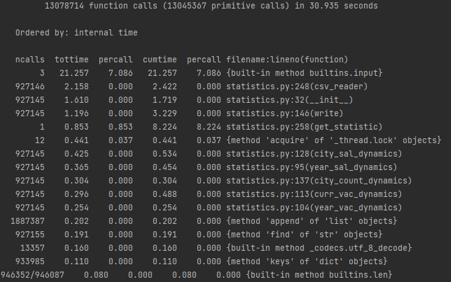
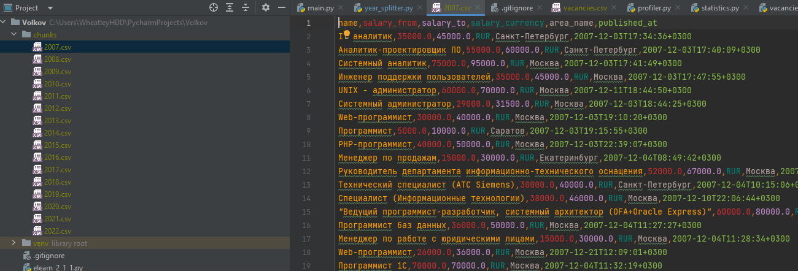
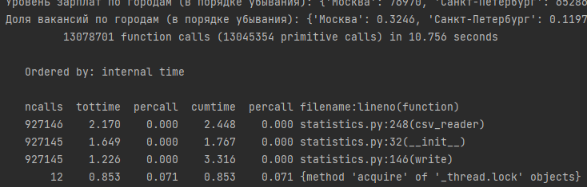
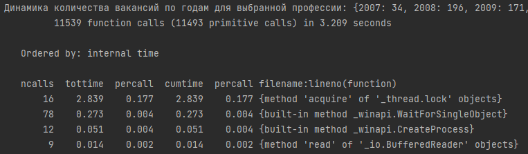

# Учебный проект по Технологиям программирования на Python
## Покрытие тестами

## Профайлинг
### Вывод вакансий

### Статистика

После переписывания

## Разбитие по годам

## Мультипроцессинг
Без мультипроцессинга

multiproccessing

