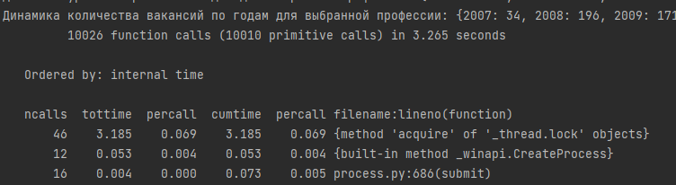
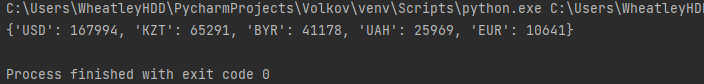
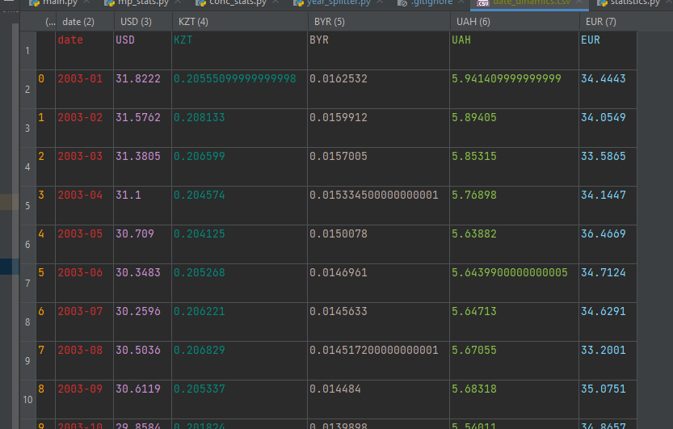
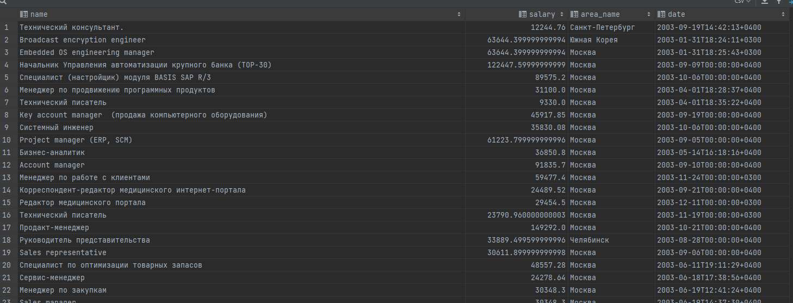
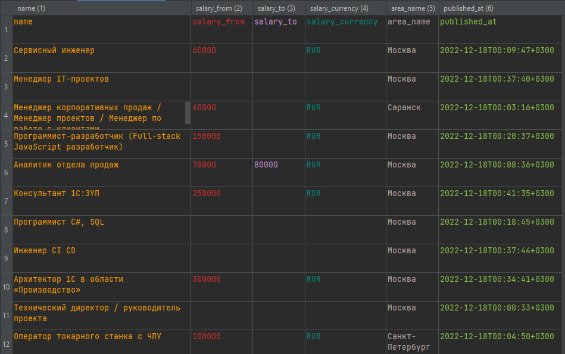

# Учебный проект по Технологиям программирования на Python
## Покрытие тестами

## Профайлинг
### Вывод вакансий

### Статистика

После переписывания

## Разбитие по годам

## Мультипроцессинг
Без мультипроцессинга

multiproccessing

concurrent.futures

## Курсы валют
Итоговый файл date_dinamics.csv

## Конвертация валют
Итоговый файл updated_vacancies.csv и updated_vacancies_100.csv

## Новые вакансии
Итоговый файл new_vacancies.csv
Решение в hhru_parser.py
